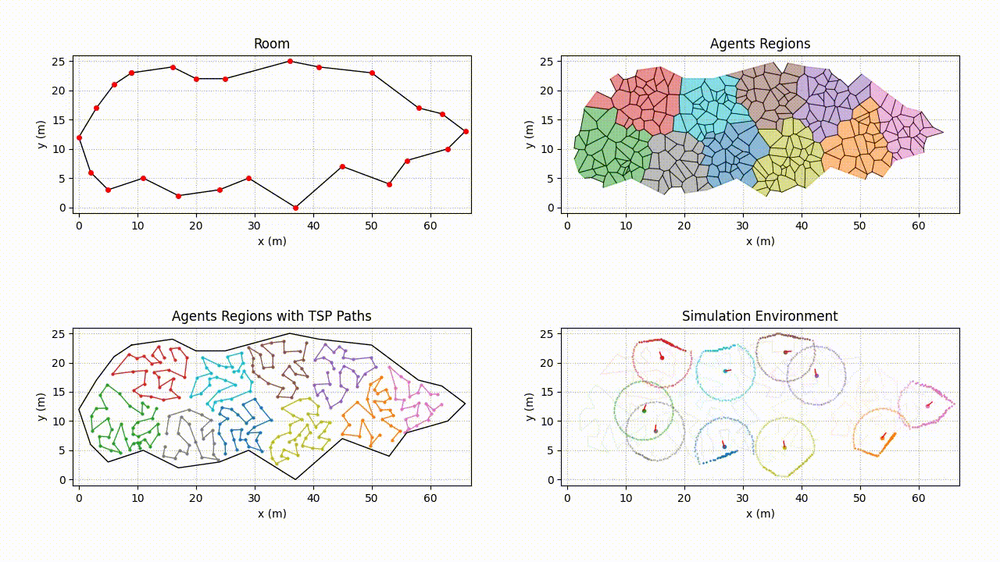

# Multi-Agent Hybrid Approach for Environment Discovery
 
## Introduction
This project focuses on simulating a multi-agent system to perform environment mapping. Agents, equipped with sensors, explore and record their surroundings, considering uncertainties in their readings. 

## Installation

### Requirements
- +[Python 3.8](https://www.python.org/downloads/)

### Installation Guide
#### Ubuntu 20.04
```bash
git clone https://github.com/PeriniM/distributed-system-project.git
cd distributed-system-project
python -m venv env
source env/bin/activate
pip install -r requirements.txt
```
#### Windows
```bash
git clone https://github.com/PeriniM/distributed-system-project.git
cd distributed-system-project
python -m venv env
./env/bin/activate
pip install -r requirements.txt
```
## [Documentation](https://perinim.github.io/distributed-system-project/)

## Project Structure
- 📄[main.py](main.py)
- 📂[Classes](Classes)
    - 📄[Agent.py](Classes/Agent.py)
    - 📄[EKF.py](Classes/EKF.py)
    - 📄[Environment.py](Classes/Environment.py)
    - 📄[RobotAssigner.py](Classes/RobotAssigner.py)
    - 📄[Sensors.py](Classes/Sensors.py)
    - 📄[Shapes.py](Classes/Shapes.py)
    - 📄[VoronoiHandler.py](Classes/VoronoiHandler.py)

## Usage
- Set the voronoi points and number of agents in the main.py file
- Run the main.py file

## Related Works
- Ahmed et al. delve deep into the intricacies of the K-Means clustering algorithm, providing a comprehensive survey and evaluation of its performance in their paper [The K-Means Algorithm](https://www.mdpi.com/2079-9292/9/8/1295).

- The challenges and solutions for the traveling salesman problem (TSP) have been extensively documented, most notably by Jünger et al. in [The traveling salesman problem](https://www.sciencedirect.com/science/article/pii/S0927050705801215).

- A meticulous [comparison of various algorithms](https://www.researchgate.net/profile/Haider-Abdulkarim/publication/280597707_Comparison_of_Algorithms_for_Solving_Traveling_Salesman_Problem/links/55bcab9808ae9289a0968a31/Comparison-of-Algorithms-for-Solving-Traveling-Salesman-Problem.pdf) geared toward solving the TSP sheds light on the complexities of the problem.

- The integration of LIDAR in robot navigation is an emerging field, exemplified by research on [LIDAR-based robot navigation](https://ieeexplore.ieee.org/document/8407319).

- An all-encompassing overview of various strategies for autonomous mobile robot path planning can be found in [Autonomous Mobile Robot Path Planning Algorithms](https://ieeexplore.ieee.org/abstract/document/4339335).

## License
[MIT](https://choosealicense.com/licenses/mit/)
